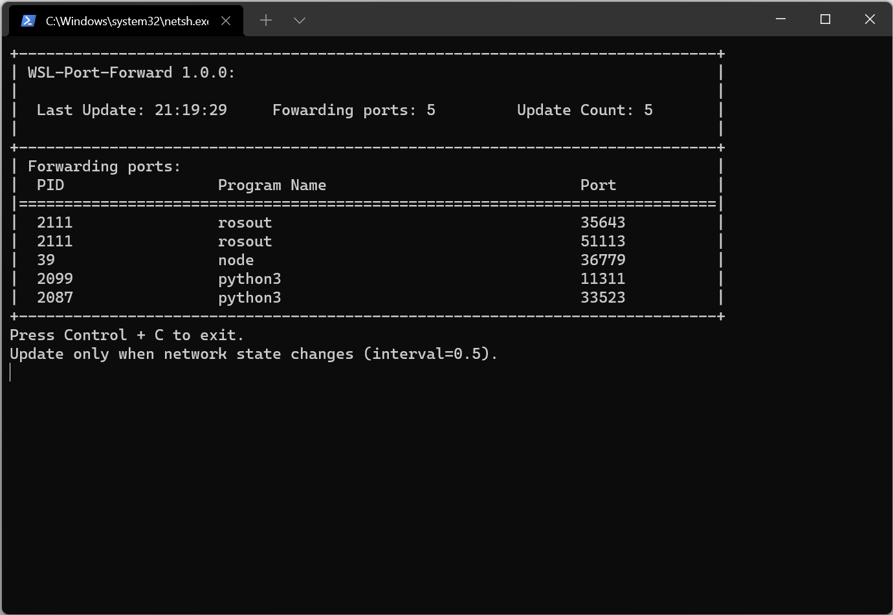

# WSL-Port-Forwarding

In Windows Subsystem for Linux 2 (WSL2), there is no obstacle for WSL to access the external network. Simultaneously, programs run in Windows (hereinafter referred to as Host) can access WSL by a LAN address (usually 172.x.x.x). However, services run by WSL2 cannot be directly accessed by remote computers, since it does NOT listen on Host's physical network interface. A simple solution is to forward the host port to WSL and configure appropriate firewall rules. This script can do this automatically.


## TODO

- [ ] a launcher to make it faster to start this script
- [ ] get the notification of program binding port in real time (NEED HELP)
- [ ] maybe UDP support?


## Principle

Built on Hyper-V, WSL2 is a  a real virtual machine, which has independent virtual network (in a different network segment from the Host). We discuss the incoming and outgoing directions of network packets from external network respectively:

INCOME: If the firewall of the Host is configured properly, the external computer can access the port on the physical network interface of the host, but the service on WSL listens on its own virtual network interface.

OUTCOME:  Windows will complete the network address translation (NAT address translation), and WSL always accesses the external network with the Host's IP, Windows can also correctly handle the response from the external network in the way of NAT address translation. Therefore, there is no obstacle for WSL to access the external network or PASSIVELY accept the results returned by the external network.

**Reference:**

> https://docs.microsoft.com/en-us/windows/wsl/compare-versions
>
> If you rely on a Linux distribution to have an IP address in the same  network as your host machine, you may need to set up a workaround in  order to run WSL 2. WSL 2 is running as a hyper-v virtual machine. This  is a change from the bridged network adapter used in WSL 1, meaning that WSL 2 uses a Network Address Translation (NAT) service for it's virtual network, instead of making it bridged to the host Network Interface  Card (NIC) resulting in a unique IP address that will change on restart. To learn more about the issue and workaround that forwards TCP ports of WSL 2 services to the host OS, see [WSL GitHub repository issue 4150, NIC Bridge mode (TCP Workaround)](https://github.com/microsoft/WSL/issues/4150).

Therefore, if we can listen to some ports on the host, and then forward the packets of external computers to appropriate port of WSL, the external computers can "directly" access the services on WSL.


## The Simplest Way to Use 

Out of the box, **no configuration required**, only three simple step.

1. Open Windows Terminal with **administrators privilege**.

    The simplest way: `Win` + `X` -> Windows PowellShell**(admin)**

2. Open WSL

   Run `wsl` in the console. (If you install multiple distribution, you may use `wsl -d Ubuntu-20.04` etc.)

3. Run this script

   If you haven't installed this script, run:

   ```bash
   pip install wsl_port_forwarding
   ```

   Once it was installed, just run: `port_forwarding`. If everything is OK, something like this will be displayed in console. 

   

Script will run automatically configure forwarding and firewall rules for the ports that WSL service bind on. You can access the services on the WSL as if they were on the host. For example, when the host IP is `192.168.1.1` and the WSL IP is `172.28.1.1`, you can just connect to python3 by `192.168.1.1:11311` instead of `172.28.1.1:11311`, while `192.168.1.1` may be directly accessed by external network.


## Requirement

1. WSL2
2. python3.6+ on WSL2
3. administrators privilege


## Install

there are two ways to install

1. Use pip to install (recommend)

```bash
pip install wsl_port_forwarding
```

then: `port_forwarding` to start this program.

2. Download from source

```bash
wget https://raw.githubusercontent.com/ColorsWind/WSL-Port-Forwarding/main/src/wsl_port_forwarding/port_forwarding.py
```

then: `python3 port_forwarding.py` to start.


## Restore

The added rules will be deleted automatically when the script exits normally, so you only need to delete the script. That is, if you install by pip, use `pip uninstall wsl_port_forwarding`, or if you install from source, just delete `port_forwarding.py`.

If you need to manually delete the configuration added by the script, you can run in power shell (or cmd) on Windows with **administrators privilege**.

```powershell
netsh.exe interface portproxy reset ipv4
netsh.exe advfirewall firewall del rule name='WSL Auto Fowards'
```

**WARNING:** All `netsh` portproxy ipv4 rules will be clean. 


## Advance Usage

**Command parameters:**

```
usage: port_forwarding [-h] [--mode {auto,manual}] [--interval INTERVAL] [--allow ALLOW]
                          [--disallow DISALLOW] [--windows_ip WINDOWS_IP] [--wsl_ip WSL_IP]
                          [--ignore_exception] [--gen_config] [--clean_rules]

A script that enable outside program access WSL2 ports by port forwarding.

optional arguments:
  -h, --help            show this help message and exit
  --mode {auto,manual}  when to update port forwarding rule.
  --interval INTERVAL   how often are network state changes detected (auto mode only).
  --allow ALLOW         program name that allows external access to the port
  --disallow DISALLOW   program name that disallows external access to the port
  --windows_ip WINDOWS_IP
                        windows ip that external can access
  --wsl_ip WSL_IP       wsl ip that windows can access
  --ignore_exception    whether interpret script when exception occurs
  --gen_config          generate config in ~/.wsl_port_forwarding.json
  --clean_rules         clean all netsh port forwarding rule and relevant firewall rules
```

**Configuration:**

Although the script can work well without configuration, we still provide some customizable configurations. Run `port_forwarding --gen-config`, then edit ` ~/.wsl_port_forwarding.json`.  Note when there is a configuration, it will print `Successfully load config.` first every time you run this script.

```json
{
    "update_interval": 0.5,
    "windows_ip": "0.0.0.0",
    "wsl_ip": "172.28.1.1",
    "ignore_exception": false, // if true, every time program encounter a exception it will pause
    "allow_program_name": [], // if set, program that is not in this list will be ignore
    "disallow_program_name": [] // if set, program that is in this list will be ignore
}
```


## License

**MIT License**

Copyright (c) 2022 ColorsWind

Permission is hereby granted, free of charge, to any person obtaining a copy of this software and associated documentation files (the  "Software"), to deal in the Software without restriction, including  without limitation the rights to use, copy, modify, merge, publish,  distribute, sublicense, and/or sell copies of the Software, and to  permit persons to whom the Software is furnished to do so, subject to  the following conditions:

The above copyright notice and this permission notice shall be included in all copies or substantial portions of the Software.

THE SOFTWARE IS PROVIDED "AS IS", WITHOUT WARRANTY OF ANY KIND,  EXPRESS OR IMPLIED, INCLUDING BUT NOT LIMITED TO THE WARRANTIES OF  MERCHANTABILITY, FITNESS FOR A PARTICULAR PURPOSE AND NONINFRINGEMENT.  IN NO EVENT SHALL THE AUTHORS OR COPYRIGHT HOLDERS BE LIABLE FOR ANY  CLAIM, DAMAGES OR OTHER LIABILITY, WHETHER IN AN ACTION OF CONTRACT,  TORT OR OTHERWISE, ARISING FROM, OUT OF OR IN CONNECTION WITH THE  SOFTWARE OR THE USE OR OTHER DEALINGS IN THE SOFTWARE.


## Limitations

1. At present, `netsh` only supports TCP forwarding, so the script can only deal with TCP protocol.

   https://docs.microsoft.com/en-us/windows-server/networking/technologies/netsh/netsh-interface-portproxy

2. No simply way to get notification when a program bind a port in Linux is found, so currently the script just gets binded ports at regular intervals (default: 0.5s). In the worst case, there is a delay of 0.5s from the external network can access service on WSL to that port has been bound. Therefore, the script may not be suitable for occasions with high frequency and low delay.